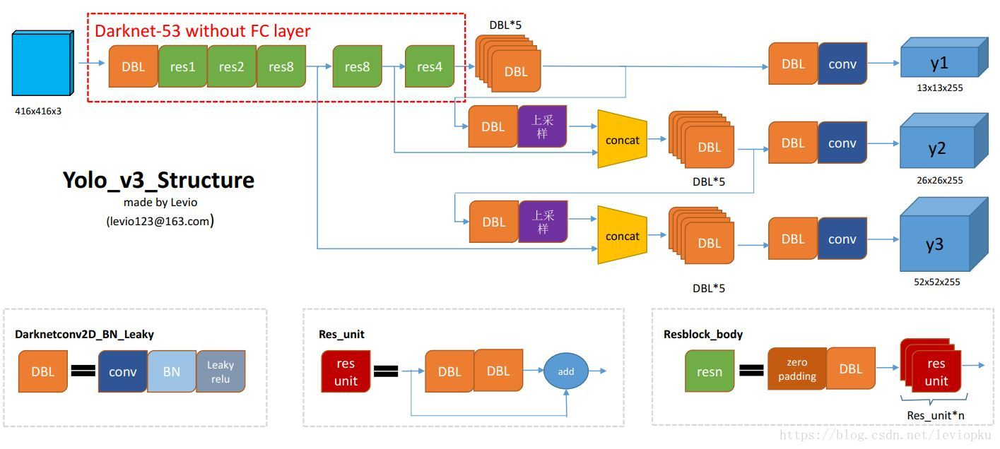

# Yolo-v3
Use yolo-v3 for prediction.

Important reference: https://github.com/1273545169/object-detection/blob/master/yolo_v3/yolo3/yolo_v3.py https://zhuanlan.zhihu.com/p/61485202

Structure of the code is similar to that for v2. For details readers can refer to my yolo-v2 repo.

The net structure of v3 is shown below:

(from https://github.com/wizyoung/YOLOv3_TensorFlow)

But there are some problems with the results. I raised an issue in https://github.com/mystic123/tensorflow-yolo-v3/issues/77. Details are:

I build tiny model from scratch thanks to the author's code. However, its prediction is sometimes bad. I checked the code several times but couldn't find anything wrong.

Many people seem to have the same problem: #47; #46; #28; even the full v3 seems to have similar problem: #40; maiminh1996/YOLOv3-tensorflow#21 (from another repo but similar implementation of yolo)
After debugging, I find that the results obtained from the first feature map (i.e. 13x13) are always good, as shown below.

But the results predicted by the second feature map (26x26) are always bad, as shown below.

The combined results are

The only difference between the first and second feature map is that the second is obtained using the upsampling option. And the author has mentioned this in https://itnext.io/implementing-yolo-v3-in-tensorflow-tf-slim-c3c55ff59dbe and choosed nearest neighbor for upsampling. Other authors i could find also use it. But the results turn out to be imperfect.

I searched for a long time and found resize option in tensorflow have some bugs :tensorflow/tensorflow#6720; https://hackernoon.com/how-tensorflows-tf-image-resize-stole-60-days-of-my-life-aba5eb093f35. So i replace the tf option of upsampling with resize in cv2 and even rescale in skimage. I also try tf.image.resize_bilinear which is used in Pytorch (https://blog.paperspace.com/how-to-implement-a-yolo-v3-object-detector-from-scratch-in-pytorch-part-2/). All these barely improve the results.

Maybe it's better to train it from scratch. But i really want to know what is wrong with the code. Is it the upsampling cause such bad prediction? Hope some one can give an answer.
